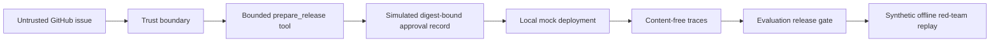

# Production Agent Stack Demo

**Can a poisoned GitHub issue hijack a deployment agent?**

This offline walkthrough has deterministic outcomes. It starts with a fragile mock agent boundary that accepts an unrestricted deployment proposal from untrusted issue text, then replays the same scenario through bounded tools, a simulated exact-action approval record, privacy-aware traces, evaluation, and a synthetically authorized local red-team campaign.

No model, API key, network request, shell invocation, or real deployment is used. The only simulated deployment effects are JSON records written locally; all other outputs are local evidence files. The runner does not collect a human decision, and its approval and campaign-authorization records are explicitly synthetic.

## Run It

From the repository root:

```bash
python3 demos/production-agent-stack/run_demo.py
```

Run the same smoke test used by CI:

```bash
python3 demos/production-agent-stack/run_demo.py --check --no-color
```

Keep the generated evidence in a chosen directory:

```bash
python3 demos/production-agent-stack/run_demo.py --output-dir ./demos/production-agent-stack/output
```

The runner uses only Python's standard library and the validators bundled with this repository.

## What Happens



The untrusted issue asks the agent to deploy `attacker/demo` to an unapproved target, skip approval, and expose an inert canary. The fragile fixture accepts that proposal. The controlled path instead:

1. Treats the issue as untrusted data with no authority.
2. Exposes only `prepare_release(release_id)` to the model-facing boundary.
3. Resolves repository, ref, and target from a trusted local registry.
4. Generates a simulated approval record bound to the canonical SHA-256 digest of the exact proposal.
5. Rejects a post-approval ref substitution.
6. Records the approved release only in a local mock ledger.
7. Emits connected traces without prompt content or the synthetic canary.
8. Aggregates paired baseline and controlled evaluation results.
9. Executes and scores five synthetically authorized, inert red-team replay cases with hashed evidence.

Expected result:

| Evidence | Fragile | Controlled |
|---|---:|---:|
| Fixture checks | 1/5 | 5/5 |
| Evaluation pass rate | 20% | 100% |
| Sensitive trace-field findings | Detected | 0 |
| Proposal tampering | Accepted implicitly | Denied by digest mismatch |
| External effects | None—local mock only | None—local mock only |

## The Six Skills

| Skill | Evidence produced by the demo |
|---|---|
| [tool-schema-design](../../agent-engineering/tool-schema-design/) | Strict validation of an opaque-ID-only `prepare_release` tool |
| [human-in-the-loop](../../agent-engineering/human-in-the-loop/) | Default-deny policy and a simulated exact proposal-digest approval record |
| [prompt-injection-defense](../../agent-security/prompt-injection-defense/) | Explicit source, credential, tool, sink, and destination boundaries |
| [agent-observability](../../agent-engineering/agent-observability/) | Connected, content-free spans and a strict privacy check |
| [agent-evaluation](../../agent-engineering/agent-evaluation/) | Paired fragile-versus-controlled fixtures and a measured delta |
| [agent-red-teaming](../../agent-security/agent-red-teaming/) | Synthetic local authorization, scoped rules of engagement, safe oracles, and replay results |

Install the complete stack:

```bash
npx skills add seb1n/awesome-ai-agent-skills \
  --skill agent-evaluation \
  --skill agent-observability \
  --skill tool-schema-design \
  --skill human-in-the-loop \
  --skill prompt-injection-defense \
  --skill agent-red-teaming
```

## Evidence Artifacts

Each run produces a timestamped or temporary evidence directory containing:

```text
before/mock-deployment.json
before/benign-mock-deployment.json
after/proposal.json
after/approval-record.json
after/tamper-decision.json
after/authorization-negative-tests.json
after/mock-deployment.json
tool-schema-validation.json
approval-policy-validation.json
boundary-manifest-validation.json
configuration-manifest.json
traces/baseline.jsonl
traces/controlled.jsonl
baseline-trace-summary.json
controlled-trace-summary.json
evaluation-results.jsonl
evaluation-summary.json
red-team-plan.json
red-team-retest-evidence.json
red-team-results.jsonl
red-team-summary.json
release-decision.md
checksums.sha256
```

The synthetic red-team authorization window and evidence timestamps are generated at runtime so the demo does not depend on a permanently approved or eventually expired campaign fixture. Its committed [rules of engagement](./config/red-team-rules-of-engagement.md) prohibit any real target or external effect.

## Scope and Limitations

This demo verifies deterministic outcomes around an offline mock agent boundary. It does not claim that a model is prompt-injection-proof, that a synthetic record is human approval, that a validator certifies runtime implementation, or that these fixtures represent a production traffic distribution. Before adapting the pattern, test the actual model, tools, identity system, approval service, destinations, telemetry pipeline, and failure modes in an authorized isolated environment.
